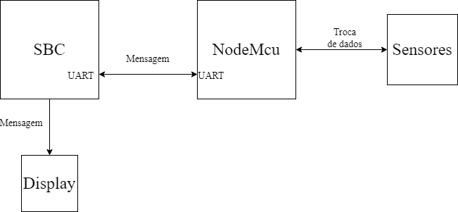

## Problema 2 - Interfaces de E/S

### Autores
<div align="justify">
    <li><a href="https://github.com/dlucasafj">@dlucasafj</a></li>
    <li><a href="https://github.com/ian-zaque">@ian-zaque</a></li>
</div>

<h1>Contextualização do Problema</h1>
Em continuação do <a href="https://github.com/ian-zaque/pbl_SD_1">Problema 1</a>, um sistema de leitura de sensores genéricos deve ser implementado. Os programas a serem implementados devem ser capazes de ler até 8 sensores digitais e um sensor analógico, verificando estes através do módulo Wifi ESP8266 NodeMcu. O sistema deve ser comandado, de forma automatizada, por um Single Board Computer (SBC) que neste contexto será a Raspberry Pi Zero W.

A comunicação será iniciada pelo SBC que envia pela UART (Universal Asynchronous Receiver / Transmitter) os dados de requisição para o NodeMcu serialmente que responde adequadamente seguindo o protocolo de comandos. Além de monitorar sensores e manipular o LED imbutido do NodeMcu, o sistema deve exibir no display anexo as informações respectivas a requisição realizada. É possível ler o problema completo <a href="./Problema 2 - Interfaces de E-S.pdf">neste link</a>.

<h1>UART</h1>
UART trata-se de um controlador de comunicação serial, é um componente do computador capaz de enviar e trocar mensagens com outros sistemas como terminais, modens e outros computadores. A comunicação serial se dá através de bytes de dados transmitidos sequencialmente de uma fonte até um destino bit a bit. No destino os bits são reunidos, formando os bytes enviados. É necessário que a fonte e o destino compartilhem uma taxa de transmissão de BPS (bits per second) para a comunicação assíncrona ser de fato realizada com sucesso. Essa taxa é chamada Baud Rate e por padrão do NodeMcu é definida em 9600 bps.

O frame UART é constituído por 2 bits de início e fim, 7 ou 8 bits de dados e mais um bit opcional de paridade. Esse frame deve ser conhecido pela fonte e pelo destino a fim de que os dois ouçam e enviem de igual forma.

<h1>Protocolos de Comunicação</h1>
A comunicação entre o SBC e o NodeMcu segue um padrão definido no corpo do problema, contendo 2 bytes por mensagem. Um byte de requisição que especifica qual função será executada e um byte de endereço do sensor que é desejado ser lido. Quando não há um sensor a ser lido, o segundo byte é dado como 0. Nas tabelas abaixo é possível ver o protocolo de requisição e o de resposta.

<div align="justify">
    
</div>
<div align="justify">
    <small>Fonte: Problema 2 - Interfaces de E/S</small>
</div>

O protocolo de requisição ainda conta com mais uma requisição: <b> Desligamento do LED do NodeMcu (Código 0x07) </b>.
<br>

<div align="justify">
    
</div>
<div align="justify">
    <small>Fonte: Problema 2 - Interfaces de E/S</small>
</div>

<h1>Single Board Computer (SBC) </h1>
SBC trata-se de um computador de placa única. Nele encontram-se presentes um processador, memória e dispositivos de entrada e saída. São uma solução rápida e integrada de software e hardware e amplamente utilizados para comunicação entre dispositivos muito específicos como sistemas robóticos e controladores de processos.
O SBC, na figura do Raspberry Pi Zero W, foi configurado para utilizar UART através de um programa escrito em linguagem C utilizando as bibliotecas wiringPi e wiringSerial. Ambas tratam de maneira simplificada o uso de portas/dispositivos seriais. Para que o programa utilize UART é necessário identificar qual dispositivo de saída será usado e definir o Baud Rate em 9600. As funções da biblioteca foram encapsuladas em métodos presentes no código do SBC de modo que pudessem ser operadas de forma mais adequada ao problema. Todas as instruções da biblioteca podem ser encontradas <a href="http://wiringpi.com/reference/serial-library/">aqui</a>, porém na solução foram utilizadas somente as seguintes:

```sh
    int serialOpen (char *device, int baud_rate);
```
A função acima é responsável inicializa o dispositivo serial e define o Baud Rate. O valor da porta serial será retornado em caso de sucesso e, caso encontre algum erro, o valor retornado será -1.

```sh
    void serialPuts (int serial_port, char *stringMsg);
```
Esta função escreve serialmente a mensagem string (stringMsg) na porta (serial_port).

```sh
    int serialGetchar (int serial_port);
```
A função serialGetChar retorna o próximo caractér a ser lido no dispositivo serial. Seu parâmetro (serial_port) indica de onde deve ler. Caso encontre erro, é retornado -1.

```sh
    void serialFlush (int serial_port);
```
Esta função elimina e descarta todo dado recebido ou em espera para ser enviado pela porta serial (serial_port).


<h1>Diagrama e Arquitetura</h1>
Com os programas devidamente compilados e presentes nas plataformas, o SBC inicia a comunicação enviando dois bytes. O primeiro será o comando da requisição e o segundo o endereço do sensor. A estrutura do programa implementado segue um loop de 5 iterações que é reiniciado ao chegar na última para que o fluxo seja automatizado. O corpo do loop verifica o índice atual e segue o padrão:

1. Definição dos bytes de requisição em varíaveis locais de tipo vetor de caractéres.
2. Descarte de dados previamente recebidos.
3. Envio dos bytes para o NodeMcu.
4. Recebimento dos bytes de resposta do NodeMcu.
5. Verificação de resposta e escrita no display.

No índice 0, é enviado a primeira requisição: solicitação do status do NodeMcu.
No índice 1, a segunda: solicitação de valor do sensor analógico.
No índice 2, a terceira: solicitação de valor de um sensor digital. A seleção do sensor digital se dá através da iteração de 1 a 9 onde cada item solicita o sensor respectivo.
No índice 3, é enviado a quarta requisição: acendimento de LED imbutido do NodeMcu.
No índice 4, a quinta requisição: desligamento do LED imbutido.

O diagrama a seguir resume o fluxo da solução do problema:

<div align="justify">
    
</div>

<br>

<h1>Máquinas e Ferramentas</h1>

1. Hardware:
    - Raspberry Pi Zero W;
    - ESP8266 NodeMcu ESP-12E Module;
2. Arquitetura Raspberry:
    - ARMv6;
3. Linguagens de programação: 
    - Assembly;
    - C;
4. Software:
    - Arduino IDE

<h1> Instruções de uso </h1>

1. Clone o repositório.
    ```sh
        git clone https://github.com/ian-zaque/pbl_SD_2.git
    ```

2. Compile os programas.
    ```sh
        make
    ```

3. Configure o módulo Wifi ESP8266 NodeMcu.
    * No software Arduino IDE:
    <ul>
        <li> Abrir arquivo SD_PBL.ino </li>
        <li> Verificar conexão e porta Wifi do ESP NodeMcu </li>
        <li> Se conectado, carregar sketch no módulo </li>
    </ul

4. Execute o arquivo abaixo gerado.
    ```sh
        sudo ./uart.run
     ```
