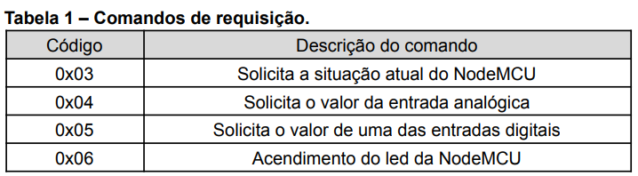
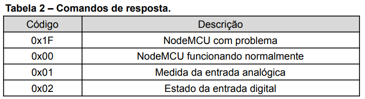

## Problema 2 - Interfaces de E/S

### Autores
<div align="justify">
    <li><a href="https://github.com/dlucasafj">@dlucasafj</a></li>
    <li><a href="https://github.com/ian-zaque">@ian-zaque</a></li>
</div>

<h1>Contextualização do Problema</h1>
Em continuação do <a href="github.com/ian-zaque/pbl_SD_1">Problema 1</a>, um sistema de leitura de sensores genéricos deve ser implementado. Os programas a serem implementados devem ser capazes de ler até 8 sensores digitais e um sensor analógico, verificando estes através do módulo Wifi ESP8266 NodeMcu. O sistema deve ser comandado, de forma automatizada, por um Single Board Computer (SBC) que neste contexto será a Raspberry Pi Zero W.

A comunicação será iniciada pelo SBC que envia pela UART (Universal Asynchronous Receiver / Transmitter) os dados de requisição para o NodeMcu serialmente que responde adequadamente seguindo o protocolo de comandos. Além de monitorar sensores e manipular o LED imbutido do NodeMcu, o sistema deve exibir no display anexo as informações respectivas a requisição realizada.

<h1>UART</h1>
UART trata-se de um controlador de comunicação serial, é um componente do computador capaz de enviar e trocar mensagens com outros sistemas como terminais, modens e outros computadores. A comunicação serial se dá através de bytes de dados transmitidos sequencialmente de uma fonte até um destino bit a bit. No destino os bits são reunidos, formando os bytes enviados. É necessário que a fonte e o destino compartilhem uma taxa de transmissão de BPS (bits per second) para a comunicação assíncrona ser de fato realizada com sucesso. Essa taxa é chamada Baud Rate e por padrão do NodeMcu é definida em 9600 bps.

O frame UART é constituído por 2 bits de início e fim, 7 ou 8 bits de dados e mais um bit opcional de paridade. Esse frame deve ser conhecido pela fonte e pelo destino a fim de que os dois ouçam e enviem de igual forma.

<h1>Protocolos de Comunicação</h1>
A comunicação entre o SBC e o NodeMcu segue um padrão definido no corpo do problema, contendo 2 bytes por mensagem. Um byte de requisição que especifica qual função será executada e um byte de endereço do sensor que é desejado ser lido. Quando não há um sensor a ser lido, o segundo byte é dado como 0. Nas tabelas abaixo é possível ver o protocolo de requisição e o de resposta.

<div align="justify">
    
    <p>Fonte: Problema 2 - Interfaces de E/S</p>
</div>

O protocolo de requisição ainda conta com mais uma requisição: Desligamento do LED do NodeMcu (Código 0x07).

<div align="justify">
    
    <p>Fonte: Problema 2 - Interfaces de E/S</p>
</div>

### Máquinas e Ferramentas

1. Hardware:
    - Raspberry Pi Zero W;
    - ESP8266 NodeMcu ESP-12E Module;
2. Arquitetura Raspberry:
    - ARMv6;
3. Linguagens de programação: 
    - Assembly;
    - C;
4. Software:
    - Arduino IDE

### Instruções de uso

1. Clone o repositório.
    ```sh
    git clone https://github.com/ian-zaque/pbl_SD_2.git
    ```

2. Compile e monte o arquivo 'display.s'.
    * Com makefile
        ```sh
            make display
        ```

    * Sem makefile
        ```sh
            as -o display.o display.s
        ```
        ```sh
            ld -o display display.o
        ```

3. Compile e monte o arquivo 'uart.c'.
    * Com makefile
        ```sh
            make uart
        ```

    * Sem makefile
        ```sh
            gcc -uart.c -o uart.run -lwiringPi
        ```

4. Configure o módulo Wifi ESP8266 NodeMcu.
    * No software Arduino IDE:
    <ul>
        <li> Abrir arquivo SD_PBL.ino </li>
        <li> Verificar conexão e porta Wifi do ESP NodeMcu </li>
        <li> Se conectado, carregar sketch no módulo </li>
    </ul

5. Execute o arquivo abaixo gerado.
    ```sh
        sudo ./uart.run
     ```
